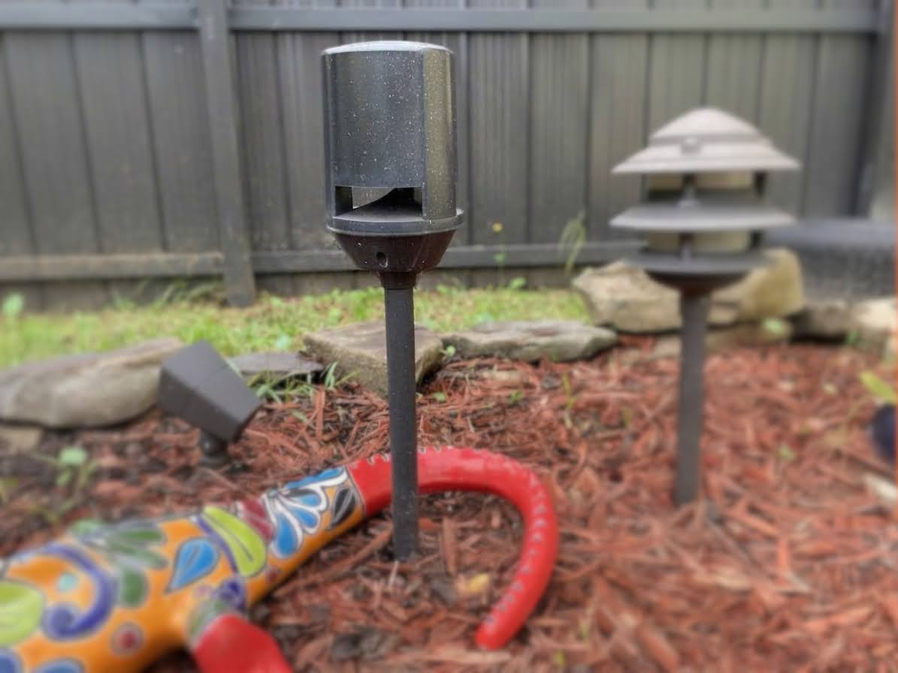
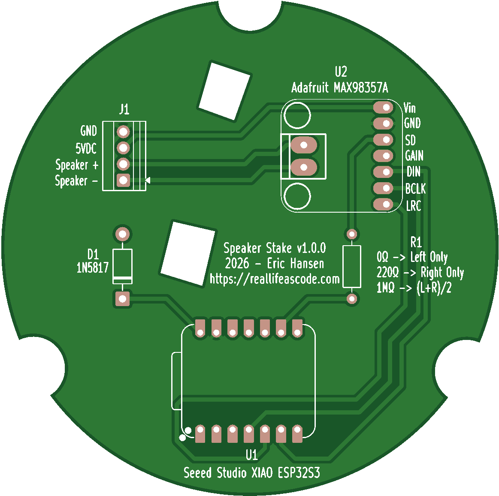
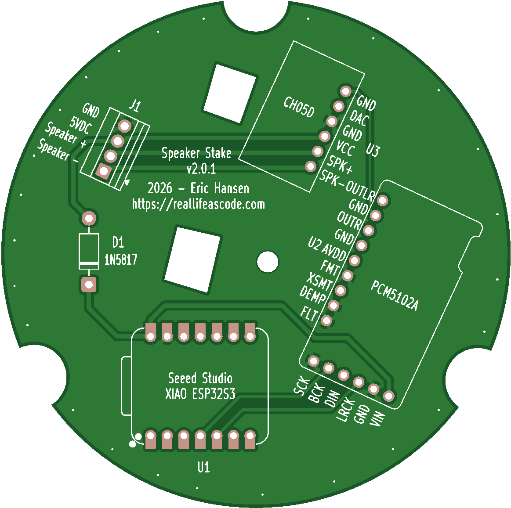

# Snapcast Speaker Stake

Hardware and firmware design to retrofit the [Hampton Bay B0029RA](https://www.homedepot.com/p/Hampton-Bay-16-9-in-Black-Outdoor-Landscape-Speaker-B0029RA-2/305754399) outdoor Bluetooth speaker into a [Snapcast](https://github.com/snapcast/snapcast) client.

The design uses an [ESP32-S3 (Seeed XIAO)](https://www.seeedstudio.com/XIAO-ESP32S3-p-5627.html) along with a [I2S DAC](https://www.amazon.com/dp/B08YNJGSN4) and [5-watt amplifier](https://www.amazon.com/dp/B0F6YBYMWY).



## 📁 Repo Layout

```
hardware/
  LICENSE          CERN-OHL-S-2.0
  libraries/       Footprint and symbol libraries used by both boards
  v1/              KiCad project and Gerbers, original 3 W design (MAX98357A)
  v2.0.1/          KiCad project and Gerbers, 5 W design (GY-PCM5102A + CH05D)
firmware/          Firmware source, unmodified except as listed in CHANGES.md
  CHANGES.md       Every file and line changed from upstream, with rationale
  patches/         upstream-changes.patch: the same changes as a unified diff
releases/
  max98357_combo/  Prebuilt flash images for the 3 W flavor
  pcm5102a_ch05d/  Prebuilt flash images for the 5 W flavor
```

## 💿 Firmware flavors

| Flavor | Hardware | Config | Release |
|---|---|---|---|
| 3 W combo | XIAO + MAX98357A | `firmware/sdkconfig.max98357_combo` | `releases/max98357_combo/` |
|  | | | |
| 5 W separate | XIAO + GY-PCM5102A + CH05D | `firmware/sdkconfig.pcm5102a_ch05d` | `releases/pcm5102a_ch05d/` |
|  | | | |

Both flavors are built from the same source tree. They differ only in DAC configuration. See `firmware/CHANGES.md` for the full list of changes from upstream.

## 📦 Flash a prebuilt release

Each release folder contains the four images needed for a full flash:

```
python -m esptool --chip esp32s3 -p COMx write_flash \
  0x0 bootloader.bin 0x8000 partition-table.bin 0x1d000 ota_data_initial.bin 0x20000 snapclient.bin
```

Replace `COMx` with the board's port. Run this from inside the release folder.

## 📚 Build from source

Requires ESP-IDF 5.5.1. Build each flavor into its own directory:

```
cd firmware
idf.py -B build -D SDKCONFIG=sdkconfig.max98357_combo build
idf.py -B build.pcm5102a_ch05d -D SDKCONFIG=sdkconfig.pcm5102a_ch05d build
```

## 📶 OTA update

With the device on the network, push a new app image to its OTA listener on port 8032. Use a direct file reference so curl sends a Content-Length header:

```
curl <device-ip>:8032 --data-binary @releases/pcm5102a_ch05d/snapclient.bin
```

The connection is reset when the transfer completes. That is expected: the device reboots into the new image.

## 📱 WiFi

WiFi credentials are not compiled in. Provision them over USB-C with Improv WiFi (for example, web.esphome.io).

## 📝 Hardware notes

- Footprint and symbol libraries used by the boards are in `hardware/libraries/`. Each project's `fp-lib-table` and `sym-lib-table` reference them with `${KIPRJMOD}/../libraries/`, so the projects open from a fresh clone. Add the libraries to your global KiCad tables only if you need them outside these projects.
- `hardware/libraries/` contains the Seeed XIAO series, GY-PCM5102A, CH05D (provisional, see its KNOWN_ISSUES), and Adafruit MAX98357A libraries as copied from the local KiCad setup.
- The V2.0.1 known issues are listed in `hardware/v2.0.1/KNOWN_ISSUES.md`. That board was sent to fab with them.

## ⚖ Licensing

- **Hardware** (`hardware/`): [CERN-OHL-S-2.0](hardware/LICENSE), the strongly reciprocal open-source hardware license. The GY-PCM5102A footprint in this project derives from a CERN-OHL-S library, and that license requires derivatives to stay under the same terms.
- **Firmware** (`firmware/`): derived from [CarlosDerSeher/snapclient](https://github.com/CarlosDerSeher/snapclient). Its LICENSE and README are in `firmware/` unchanged. Our changes are listed in `firmware/CHANGES.md`.
- **Third-party libraries**: the Adafruit MAX98357A library (`adafruit-MAX98357.*`) comes from [besi/kicad-adafruit-MAX98357](https://github.com/besi/kicad-adafruit-MAX98357), and the Seeed XIAO library (`Seeed_Studio_XIAO_Series.*`) comes from Seeed Studio. Neither license was checked before copying. Confirm both allow redistribution before publishing this repo.
